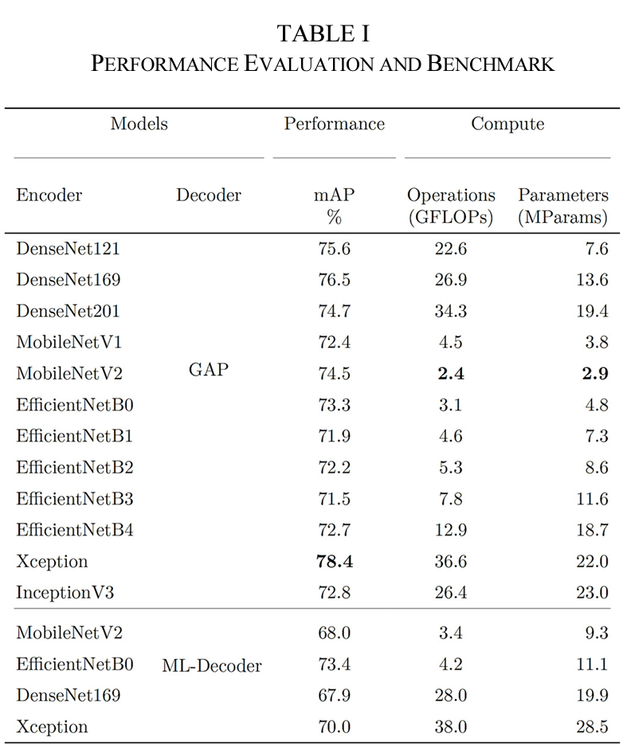

# DISHSCAN

Welcome to the Dishscan Repository!

This project is dedicated to the exploration of  Machine Learning (ML) approaches for the visual understanding and analysis of nutritional ingredients in various dishes and plates.  
We conducted a broad evaluations of ML vision models for food ingredient recognition, which are documented and discussed in this repository.



## About the Project
In the realm of dietary science and health, recognizing and understanding the nutritional content of food is crucial. This project focuses on developing and deploying machine learning models that can effectively identify and analyze the ingredients within a given dish or food-plate image. Our goal is to facilitate automatic understanding of the nutritional composition of various recipes and meals consumed in day-to-day life. This work focusses on evaluating the performance of various ML algorithms to detect ingredients or food-items present in a digital food image.  
Recognition of the actual ingredients is one of the two essential ML functions towards our envisioned food assessment system depicted, the other is the portion estimation.

## Publication
Our research in this field has been published in the paper titled "Food Ingredients Recognition Through Multi-label Learning"
The publication can be accessed [here](publication.pdf).

<a id="1">[1]</a> 
Ismail, Rameez, and Zhaorui Yuan, 
Food Ingredients Recognition Through Multi-label Learning. 
Embedded Artificial Intelligence: Devices, Embedded Systems, and Industrial Applications(2023): 105. 

## Getting Started

To get started with this project, follow these steps:

1. Clone this repository to your local machine
   ```bash
   git clone git@github.com:RameezI/dishscan.git
   ```

2. Create the *dishscan* conda environment:  
    ```bash
     conda env create -f environment.yml
     conda activate dishscan
    ```
3. Make the dishscan package discoverable
   ```bash
   cd dishscan
   pip install -e .
   ```  
4. Train a specific encoder/decoder setting
    ```bash
    python scanner.py --encoder MobileNetV1 --decoder GlobalAvgPoolDecoder
    ```
5. To evaluate a trained model:
   ```bash
    # By default trained model is saved under a time_stamped `run_id` directory located at ~/tensorflow_logs/dishscan
    # Assuming run_id directory is `20220813-0924` you can evaluate the saved model using the scanner script: 
    python scanner.py --run_id 20220813-0924 --skip_training
   ````

For a complete list of options available to use with the `scanner` program:
 ```bash
 python scanner --help
 ```

## Acknowledgments
The research leading to these results has received funding from the European Union's ECSEL Joint Undertaking under grant agreement n° 826655 - project TEMPO.  


-------------------------------
This project is maintained by:
**Rameez Ismail**
- Email: rameez.ismail@protonmail.com
- [GitHub-RameezI](https://github.com/RameezI)
- [LinkedIn](www.linkedin.com/in/rameezismail)


Feel free to reach out for any questions, contributions, or collaboration opportunities.
